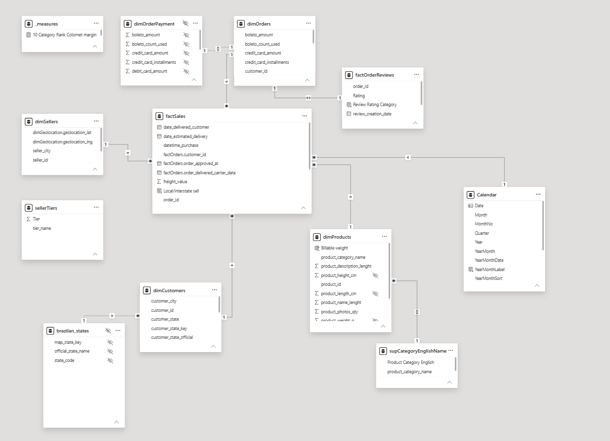

# Olist Brazilian E-Commerce Platform Analytics project
This project takes the Olist database with 2+ years of sales and transforms the data into an excecutive PowerBI report. Data cleaning, transformation and modeling was done in full using Power Query. Visualizations in the pages include novel and complex DAX custom measures. 

## 🛠️ Tools Used
***


## 💡 Skills Demonstrated
***


***

## ⚡ Report Demo


## 📊 Description 
This Power BI report provides executive insights into key Olist platform operations: Management, Finances, Logistics, and Marketing. The report answers high-level business questions by summarizing historical trends and performance diagnostics across customers and sellers.

Key insights derived from the report: 
- *KPIs*: Average Order Value, On-Time Delivery Rate, Profit Margin, Reorder Rate
- *Financial Health*: Impact of credit card commissions on net margins
- *Geographic Analysis*: Product category popularity and logistics performance in São Paulo vs. other Brazilian states
- *Market Intelligence*: Reorder frequency patterns and seller performance tiers
- *Delivery and Fulfillment*: Real-time visibility into order transit and carrier performance

### 📂 Repository Structure

```text
.
├── assets/                          # Repository visuals, demo GIFs, and report icons
├── olist_report_pbip.Report/        # Power BI report layout definitions and visual metadata
├── olist_report_pbip.SemanticModel/ # Data model schema, relationships, and TMDL measures
├── .gitignore                       # Git exclusion rules
├── olist_report_pbip.pbip           # Main Power BI Project file entry point
└── README.md                        # Documentation
```

## 🧑‍💻 Data Model
The report is built on a **Star Schema** centered around the transactional core `factSales` table, designed to optimize DAX performance and ensure clean filter propagation across all reporting dimensions.


The data model follows a **Star Schema** centered around `factSales`, optimized for DAX calculation speed and clean single-direction filter context.


* **Core Fact**: `factSales` captures order item transactions, timestamps, and freight metrics.
* **Dimensions**: Direct 1:Many relationships to `dimCustomers`, `dimSellers`, `dimProducts`, and `Calendar` drive slicing across geography, product categories, and time context.
* **Granularity & Mapping**: Bridge tables (`dimOrderPayment`, `dimOrders`) manage order-level payment types, while `supCategoryEnglishName` handles product category translations.

### 🧮 Technical DAX Highlight

**Dynamic Seller Segmentation (Log-Normal Z-Score)**  
To handle severe revenue skewness without static binning, this measure applies a logarithmic transformation ($\log_{10}$) to GMV to normalize distribution, dynamically calculates Mean and Standard Deviation across the active filter context, and segments marketplace sellers into dynamic Z-Score performance tiers[cite: 1].

```dax
Dynamic Tier Seller Count = 
VAR SelectedTier = SELECTEDVALUE(sellerTiers[tier_name])

// 1. Get active sellers in current canvas context
VAR ActiveSellers = 
    ADDCOLUMNS(
        VALUES(dimSellers[seller_id]),
        "@SellerGMV", CALCULATE(SUM(factSales[price])),
        "@LogGMV", LOG10(CALCULATE(SUM(factSales[price])) + 1)
    )

VAR FilteredActiveSellers = FILTER(ActiveSellers, [@SellerGMV] > 0)

// 2. Compute Mean & Standard Deviation dynamically
VAR MeanLogGMV = AVERAGEX(FilteredActiveSellers, [@LogGMV])
VAR StdDevLogGMV = STDEVX.P(FilteredActiveSellers, [@LogGMV])
VAR SafeStdDev = IF(ISBLANK(StdDevLogGMV) || StdDevLogGMV = 0, 1, StdDevLogGMV)

// 3. Assign dynamic Z-score tiers
VAR SellersWithTiers = 
    ADDCOLUMNS(
        FilteredActiveSellers,
        "@AssignedTier", 
            VAR Z = DIVIDE([@LogGMV] - MeanLogGMV, SafeStdDev, 0)
            RETURN
                SWITCH(
                    TRUE(),
                    Z > 2.0,   "1. Top Sellers",
                    Z > 1.0,   "2. High Performing",
                    Z >= -1.0, "3. Core Distribution",
                    Z >= -2.0, "4. Low Performes",
                    "5. Micro or Inactive"
                )
    )

// 4. Return distinct count of sellers in the active tier
RETURN
    COUNTROWS(
        FILTER(SellersWithTiers, [@AssignedTier] = SelectedTier)
    )
```


## 👤 Author

**Guillermo Villegas Morales**  
*BSc in Data Science & Mathematics Engineering | Analytics Engineer*

[](https://www.linkedin.com/in/guillermo-villegas)
[](https://github.com/guillermo-vm)

## Resources
- Database: https://www.kaggle.com/datasets/olistbr/brazilian-ecommerce